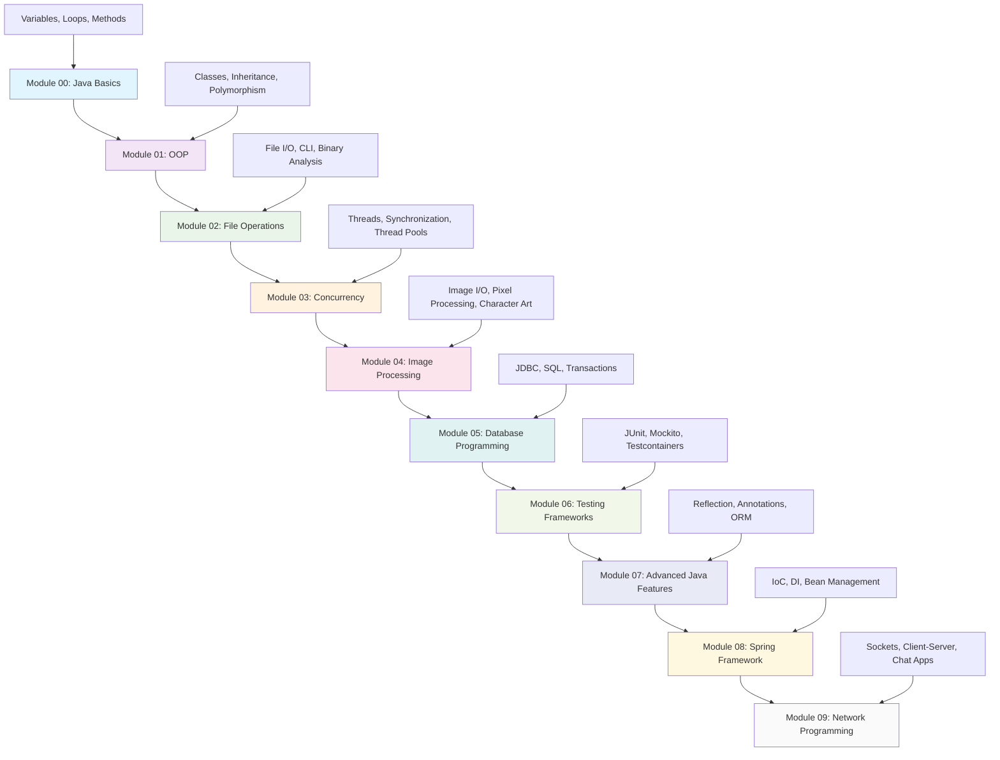

# Java Picine - School 42 Java Projects

A comprehensive collection of Java projects covering fundamental programming concepts to advanced enterprise development.

## 📊 **Module Progression & Skills Development**

## �� **Learning Path**
