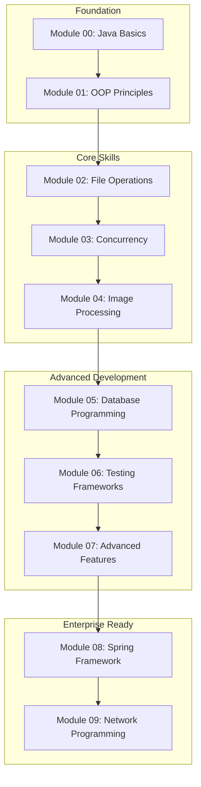
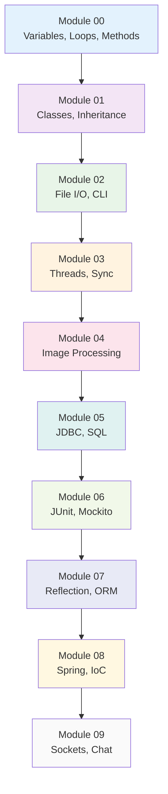

# Java Picine Module Progression Diagrams

## 🎯 **Option 1: Simple Skills Progression (LinkedIn Perfect)**

```mermaid
graph LR
    A[🔰 Basics] --> B[🏗️ OOP] --> C[📁 Files] --> D[⚡ Threads] --> E[🖼️ Images]
    E --> F[🗄️ Database] --> G[🧪 Testing] --> H[🔮 Advanced] --> I[🌱 Spring] --> J[🌐 Network]
    
    style A fill:#ffeb3b
    style B fill:#2196f3
    style C fill:#4caf50
    style D fill:#ff9800
    style E fill:#e91e63
    style F fill:#9c27b0
    style G fill:#00bcd4
    style H fill:#795548
    style I fill:#8bc34a
    style J fill:#607d8b
```

## 🚀 **Option 2: Learning Journey (Professional)**

## 📊 **Option 3: Skills Radar (Technical Overview)**

## 💡 **Usage Recommendations:**

- **Option 1**: Perfect for LinkedIn posts - simple, colorful, easy to understand
- **Option 2**: Great for technical presentations and detailed documentation
- **Option 3**: Ideal for GitHub README files and technical overviews

## 🎨 **Customization Tips:**

1. **Colors**: Use your brand colors or professional color schemes
2. **Icons**: Add relevant emojis for visual appeal
3. **Text**: Keep descriptions concise and impactful
4. **Layout**: Choose direction (LR, TD, BT) based on your content needs
